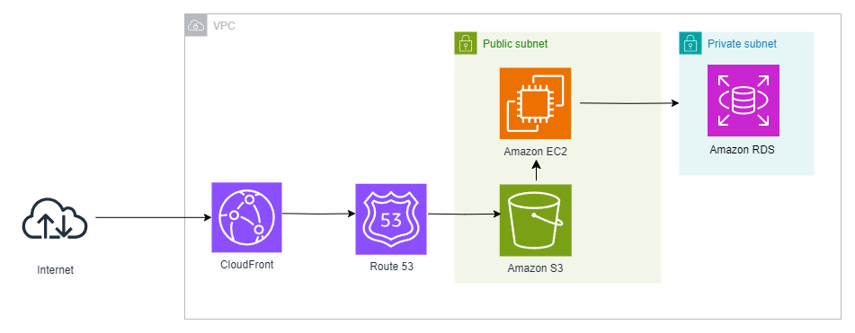

# HTTPS, SSL, CERTBOT and Let's Encrypt!



This is more of a guide and collection of the mistakes I made when setting up HTTPS for my website. To take note of, for this particular deployment I used the following services from **AWS**: **S3, EC2, RDS (PSQL), Route 53, CloudFront** and **Let's Encrypt, Certbot, NGINX**. In this particular configuration, **NGINX** is installled on the `EC2` instance itself.The frontend and backend are built and hosted separately. 

---

# Enabling HTTPS on the Front End

 The main steps to enable HTTPS on frontend
1. Purchase a domain name from `AWS Route 53` and set up hosted zone.
2. Go to `AWS Certificate Manager` and request a certificate for the domain name. Make sure the certificates are in the `us-east-1` if you are going to use `CloudFront`.
3. When requesting the certs, ensure that you click on the `Created DNS record in Route 53` button to automatically create the necessary DNS records if using DNS validation. Failing to do so will result in the certficate being stuck on pending.
4. Once the certificate is issued, go to `CloudFront` and create a new distribution. Previously, I had `S3` configured to host static websites and be publicly accessible. Reconfigure it to be private and only accessible via the `CloudFront` distribution. This can be done through updating the policy provided afterwards. Most of the settings at this stage should be self explanatory (e.g. `Redirect HTTP to HTTPS`, `Use Custom SSL Certificate` etc). 
> If the certificate is not showing up in the dropdown, ensure that the certificate is in the `us-east-1` region.
5. After the distribution has been created, look for a `Distribution Domain Name`. An example is `d2bc429too7mtj.cloudfront.net`. 
6. Once this distribution has been created, will need to create `CNAME` records that point to the distribution link above. When creating the `CNAMEs`, remember to create with both `www.` and without as the prefix.

At this point, the frontend should be accessible using `HTTPS`.

# Enabling HTTPS on the Back End.
In this particular set up, `NGINX` and the built server files exist on the same `EC2`. There are no load balancers in this instance. `NGINX` is used to just redirect requests from `443` to `8000` where the server is listening on. 

The main steps to enable HTTPS on backend:
1. Create `A` records in `Route 53` for the intend backend domain name. In this case, it was `www.api.eco-yah.com` and `api.eco-yah.com`.
2. Go to `AWS Certificate Manager` and request a certificate for the domain name. Make sure the certificates are in the `us-east-1` if you are going to use `NGINX`. 
> If the certificate is not showing up in the dropdown, ensure that the certificate is in the `us-east-1` region.
3. Ensure that `NGINX` is installed on the `EC2` instance alongside `Certbot`. Create a `default.conf` inside `/etc/nginx/conf.d/` and add the following configuration. `Certbot` will automatically update this file when it renews the certificates.
```
server {
    listen 80;
    server_name www.api.eco-yah.com api.eco-yah.com;

    location / {
        proxy_pass http://localhost:8000;
        proxy_set_header Host $host;
        proxy_set_header X-Real-IP $remote_addr;
        proxy_http_version 1.1;
        proxy_cache_bypass $http_upgrade;
        proxy_set_header Connection 'upgrade';
    }
}
```
4. Set up `Certbot` using the commands below.
5. Once `Certbot` is set up, verify the `default.conf` has been updated with the necessary SSL configurations.
6. We will have to update the firewall settings `UFW` settings.
> **ENSURE THAT YOU ALSO ALLOW PORT 22! IF NOT YOU WILL NOT BE ABLE TO SSH INTO THE SESSION AND WILL HAVE TO RESTART THE ENTIRE CONFIG!!!**
7. Once the firewall settings have been updated, restart `NGINX` and the server. Ensure that the security group for the `EC2` instance has the necessary ports open too.

You should now be able to access the backend using `HTTPS`.

**NGINX**

`default.conf`

```
server {
    # Handle requests for both server names
    server_name www.api.eco-yah.com api.eco-yah.com;

    # Proxy requests to your application running on port 8000
    location / {
        proxy_pass http://localhost:8000;
        proxy_set_header Host $host;
        proxy_set_header X-Real-IP $remote_addr;
        proxy_http_version 1.1;
        proxy_cache_bypass $http_upgrade;
        proxy_set_header Connection 'upgrade';
    }

    listen 443 ssl; # managed by Certbot
    ssl_certificate /etc/letsencrypt/live/www.api.eco-yah.com/fullchain.pem; # managed by Certbot
    ssl_certificate_key /etc/letsencrypt/live/www.api.eco-yah.com/privkey.pem; # managed by Certbot
    include /etc/letsencrypt/options-ssl-nginx.conf; # managed by Certbot
    ssl_dhparam /etc/letsencrypt/ssl-dhparams.pem; # managed by Certbot
}

server {
    # Redirect HTTP traffic to HTTPS
    if ($host = api.eco-yah.com) {
        return 301 https://$host$request_uri;
    }

    if ($host = www.api.eco-yah.com) {
        return 301 https://$host$request_uri;
    }

    listen 80;
    server_name www.api.eco-yah.com api.eco-yah.com;

    # Rewrite all requests to HTTPS permanently
    location / {
        rewrite ^ https://$host$request_uri permanent;
    }
}
```

### Collection of Useful Commands
```
systemctl start nginx
systemctl stop nginx
systemctl status nginx
systemctl restart nginx

# UFW
sudo ufw allow OpenSSH
sudo ufw allow 'Nginx Full'
sudo ufw enable
sudo ufw status 
```
---

# Deploying a SPA on CloudFront 
When deploying a SPA on `CloudFront`, there are a few things to take note of.
1. Ensure that the `Origin Domain Name` is the `S3` bucket that is hosting the static files.
2. Ensure that the `Origin Path` is set to the `folder` that contains the `index.html` file. This is usually `dist` or `build` depending on the build configuration.
3. Set up the `Error Pages` to redirect to the `index.html` file. This is to ensure that the `React Router` can handle the routing. Set up `404` to redirect to `/index.html` and `403` to redirect to `/index.html` IF NEEDED.